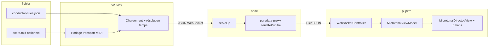

# Protocole des consignes chef d’orchestre

Ce document décrit le parcours des **consignes** depuis un **fichier lu côté console** jusqu’à l’**UI SirenePupitre** : texte du chef, et **paramètres d’affichage** pour la cible de hauteur, la vitesse de glissando et l’ouverture du volet — le tout via **JSON** sur le réseau.

**État d’implémentation** : `MicrotonalViewModel.qml` expose les champs d’affichage ; `ConductorCueDriver.qml` charge le JSON (`GET /api/midi/conductor-cues`) en mode **séquencé** et avance les consignes selon la position **tick** (Pure Data, format binaire 0x01 6 octets) ou **mesure/temps** (0x01 9 octets) ; en mode **dirigé**, les messages **`CONDUCTOR_CUE`** reçus sur le WebSocket sont appliqués (`WebSocketController.qml`). Le filtre `sirenTrackIndex` côté pupitre utilise le **canal MIDI de la sirène courante** (`sirenConfig.sirens[].midiChannel` sur la sirène sélectionnée ; à défaut, secours `parseInt(id)` si 1–16). Le **relai console → Node → pupitre** pour `CONDUCTOR_CUE` reste à finaliser côté `server.js` / proxy si besoin.

---

## 1. Vue d’ensemble



**Principe** : le pupitre ne maintient qu’une connexion WebSocket **sortante** vers le serveur Node (`SirenePupitre` → `ws://<hôte-console>:10002` par défaut, voir `config.js`). Les consignes **relèvent du même hub** que le reste du trafic JSON : la console envoie un message au Node, qui le **relaye** vers le ou les pupitres concernés (`pureDataProxy.sendToPupitre`).

---

## 2. Fichier de consignes côté console

### 2.1 Emplacement et nom

- Fichier **JSON** UTF-8, extension recommandée `.json`.
- Convention : même **stem** qu’un fichier MIDI partagé, ex. `livret/concerto/conductor-cues.json` avec `livret/concerto/concerto.mid`, ou chemin configuré dans la console / le séquenceur.

### 2.2 Schéma `version` 1

| Champ racine | Type | Obligatoire | Description |
|--------------|------|-------------|-------------|
| `version` | `number` | oui | Toujours `1` pour cette spec. |
| `metadata` | `object` | non | Infos d’édition (titre, auteur, lien vers MIDI). |
| `cues` | `array` | oui | Liste ordonnée d’événements de consigne. |

**Sirène vs pupitre**

- La **sirène** est identifiée en priorité par le **canal MIDI** de l’événement (**1–16**), champ `sirenTrackIndex`. Une piste DAW / une voie dans un `.mid` peut porter une étiquette (`sirenTrackName`) pour l’édition, mais le routage machine suit le **canal**.
- Le **pupitre** est le poste qui **joue** une sirène assignée. Le JSON peut mélanger les consignes de **tous** les canaux ; le routage **canal → pupitre** est une couche à part (`metadata.sirenToPupitre` ou config console).

**`metadata` (recommandé)**

| Champ | Type | Description |
|-------|------|-------------|
| `title` | `string` | Titre de la pièce ou du livret. |
| `midiFile` | `string` | Chemin relatif ou absolu du `.mid` utilisé pour l’alignement temporel. |
| `ppq` | `number` | Pulses per quarter du MIDI ; doit correspondre au fichier chargé si les consignes utilisent `tick`. |
| `tickOrigin` | `string` | Ex. `midi_item_start` (tick relatif à un item) ou `project_timeline_qn` (tick global projet, export Reaper multi-pistes). |
| `sirenChannels` | `array` | Liste des canaux sirène (ex. export Reaper) : `{ midiChannel, trackName }` avec **midiChannel** 1–16. |
| `sirenToPupitre` | `object` | Optionnel : map **canal MIDI** (ex. `"3"`) ou nom de piste → `P1`…`P7` pour résoudre `targets` à l’export ou au runtime. |

**Élément de `cues`**

| Champ | Type | Obligatoire | Description |
|-------|------|-------------|-------------|
| `id` | `string` | non | Identifiant stable (évite les doubles envois si reprise). |
| `text` | `string` | oui | Texte affiché (zone consigne du chef). |
| `sirenTrackIndex` | `number` | selon source | **Canal MIDI de la note (1–16)** ; identifie la sirène dans un fichier multi-pistes, pas l’index de piste DAW. |
| `sirenTrackName` | `string` | selon source | Nom de la **piste** (DAW) portant la note (lisibilité / debug). |
| `targets` | `string[]` \| `"all"` | selon routage | Pupitres `P1`…`P7` à notifier ; peut être `[]` si le routage passe uniquement par `siren*` + `sirenToPupitre`. |
| **Ancrage temporel** | *un seul mode par entrée* | oui | Voir ci-dessous. |
| **Cible de hauteur** | voir §2.2.1 | recommandé | Pour alimenter l’UI (fréquence / ruban). |
| `glissSpeed` | `number` \| `string` | recommandé | Vitesse du glissando (voir §2.2.1). |
| `voletOpen` | `number` | recommandé | Ouverture du volet **0.0–1.0**. |

**Ancrage temporel** (une seule forme par entrée, priorité de résolution si plusieurs champs présents : `tick` > `bar`+`beatInBar` > `tMs`)

| Champs | Description |
|--------|-------------|
| `tick` | Position en **ticks MIDI** (entier ≥ 0). Référence selon `metadata.tickOrigin` : soit relatif à un item, soit **timeline projet** commune à toutes les pistes (fichier multi-pistes). |
| `bar`, `beatInBar` | Mesure et battement dans la mesure (1-based), résolus en ticks via la **même** carte temps/signature que le MIDI chargé. |
| `tMs` | Temps écoulé depuis le début de la lecture en millisecondes (secours si pas de MIDI ou tests). |

#### 2.2.1 Paramètres d’affichage microtonal (cible, glissando, volet)

Ces champs sont ceux attendus par `MicrotonalViewModel` / `MicrotonalDirectedView` / rubans. Ils doivent être **retranscrits tels quels** dans le message `CONDUCTOR_CUE` (sections 3–4).

**Cible de hauteur** — une seule représentation par consigne (priorité si plusieurs présents : `midiAnchor`+`targetCents` > `targetFrequencyHz`) :

| Champ | Type | Description |
|-------|------|-------------|
| `midiAnchor` | `number` | Note MIDI **continue** (ex. `69` = La4), ancre tempérée. |
| `targetCents` | `number` | Décalage en **cents** par rapport à cette ancre (aligné ruban / `MicrotonalPitchRibbon`). |
| `targetFrequencyHz` | `number` | Alternative : fréquence cible en Hz ; le client peut la convertir en `midiAnchor`/`targetCents` pour l’UI (formule MIDI standard) si le fichier ne fournit pas déjà l’ancre en MIDI. |

**Glissando** — même échelle que `MicrotonalTypes.qml` :

| `glissSpeed` (nombre) | Libellé UI |
|-------------------------|------------|
| `0` | instantané |
| `1` | très rapide |
| `2` | rapide |
| `3` | lent |
| `4` | très lent |

Forme **chaîne** acceptée (insensible à la casse) : `instant`, `veryFast`, `fast`, `slow`, `verySlow` — à normaliser côté émetteur ou récepteur vers `0`…`4`.

**Volet** :

| Champ | Type | Description |
|-------|------|-------------|
| `voletOpen` | `number` | **0.0** = fermé, **1.0** = ouvert (interpolation linéaire possible côté affichage). |

En **authoring** (ex. export Reaper `Mecaviv_ExportConductorCues.lua`), `voletOpen` est dérivé de la **vélocité** de la note (0–127 → 0.0–1.0), pas d’un CC ; le fichier inclut `metadata.voletSource: "note_velocity"`.

Champs **optionnels** utiles pour d’autres panneaux (même sémantique que le view model) : `phase`, `harmonicIndex`, `partialLabel`, `currentCents` (position courante affichée au moment de la consigne).

### 2.3 Exemple (texte + cible + glissando + volet)

```json
{
  "version": 1,
  "metadata": {
    "title": "Démo consignes",
    "midiFile": "./score.mid",
    "ppq": 480
  },
  "cues": [
    {
      "id": "c1",
      "tick": 0,
      "targets": ["P1"],
      "text": "Entrée — attaque partielle, puis gliss vers La tempéré +12 ct.",
      "midiAnchor": 69.0,
      "targetCents": 12.0,
      "glissSpeed": 3,
      "voletOpen": 0.35
    },
    {
      "id": "c2",
      "bar": 12,
      "beatInBar": 1,
      "targets": ["P1", "P3"],
      "text": "Rappel : H5, grille tempérée, volet ouvert.",
      "midiAnchor": 69.0,
      "targetCents": 0.0,
      "glissSpeed": "fast",
      "voletOpen": 0.8
    }
  ]
}
```

### 2.4 Déclenchement

- Le **moteur de lecture** (ex. `SirenConsole/webfiles/midi-sequencer.js`) fournit la position courante (`currentTick`, mesure / temps, etc.).
- Lorsque la position **dépasse** le seuil d’une consigne **et** que cette consigne n’a pas déjà été émise pour cette session de lecture (suivi par `id` ou par index), la console prépare un message **`CONDUCTOR_CUE`** (section 3) et l’envoie au Node.
- Reprise depuis le milieu : ne déclencher que les consignes dont le tick (ou équivalent) est **≤** position courante si politique « rattrapage » ; sinon n’émettre que les événements **strictement futurs** selon le produit.

---

## 3. Message JSON : console → serveur Node

Transport : **WebSocket texte** vers le même endpoint que l’UI console (`WebSocketManager.sendMessage` → `ws://<hôte>:<port-http-console>/ws`, ex. port 8001).

Le serveur doit accepter un objet JSON avec :

| Champ | Type | Obligatoire | Description |
|-------|------|-------------|-------------|
| `type` | `string` | oui | Valeur fixe `"CONDUCTOR_CUE"`. |
| `pupitreId` | `string` | selon routage | `P1`…`P7` pour un envoi ciblé ; peut être omis si `targets` est utilisé côté serveur (voir variante broadcast). |
| `cueId` | `string` | non | Reprise du `id` fichier pour logs / dédup. |
| `text` | `string` | oui | Texte à afficher. |
| `midiAnchor` | `number` | non | Voir §2.2.1. |
| `targetCents` | `number` | non | Voir §2.2.1. |
| `targetFrequencyHz` | `number` | non | Voir §2.2.1 (alternative à la paire MIDI + cents). |
| `glissSpeed` | `number` \| `string` | non | `0`…`4` ou chaîne alias. |
| `voletOpen` | `number` | non | `0.0`…`1.0`. |
| `sirenTrackIndex` | `number` | non | Canal MIDI **1–16** (sirène). |
| `sirenTrackName` | `string` | non | Nom de piste (référence éditeur). |
| `seq` | `number` | non | Numéro monotone optionnel pour ordonner côté pupitre. |
| `timestamp` | `number` | non | `Date.now()` côté émetteur (ms). |

**Variante broadcast** : `type: "CONDUCTOR_CUE"`, `targets: ["P1","P2"]` ou `"all"`, plus les champs de contenu (`text`, paramètres microtonaux) — le Node itère et appelle `sendToPupitre` pour chaque pupitre connecté. Si les consignes viennent d’un livret **multi-sirènes**, la console résout `siren*` → `pupitreId` puis n’envoie chaque message qu’au pupitre qui joue cette sirène.

**Traitement attendu dans `server.js`** (à implémenter) :

1. Valider le JSON.
2. Pour chaque pupitre cible : `pureDataProxy.sendToPupitre(pupitreId, payload)` avec un payload pupitre décrit en section 4.
3. Optionnel : journaliser ou renvoyer un accusé aux clients UI console.

---

## 4. Message JSON : serveur Node → pupitre

Même canal que les autres messages texte vers SirenePupitre (WebSocket sortant pupitre → Node, trafic **serveur → client** sur cette socket).

| Champ | Type | Obligatoire | Description |
|-------|------|-------------|-------------|
| `type` | `string` | oui | `"CONDUCTOR_CUE"`. |
| `text` | `string` | oui | Texte affiché. |
| `midiAnchor` | `number` | non | Cible d’affichage (note MIDI continue). |
| `targetCents` | `number` | non | Cents par rapport à l’ancre tempérée. |
| `targetFrequencyHz` | `number` | non | Si présent sans `midiAnchor`/`targetCents`, le pupitre peut en déduire l’affichage. |
| `glissSpeed` | `number` | non | `0`…`4` après normalisation. |
| `voletOpen` | `number` | non | Ouverture **0.0–1.0**. |
| `sirenTrackName` | `string` | non | Optionnel : affichage / debug (consigne issue de telle piste sirène). |
| `cueId` | `string` | non | Traçabilité. |
| `seq` | `number` | non | Ordre relatif si plusieurs consignes rapprochées. |
| `timestamp` | `number` | non | Horodatage émission. |

Remarque : pas de champ `pupitreId` nécessaire dans le message pupitre si la connexion est déjà **par pupitre** ; en revanche il peut être dupliqué pour debug.

**Contenu minimal côté pupitre** : pour que l’UI reflète **à la fois** la consigne textuelle et les **indicateurs** (ruban, volet, libellé de vitesse), au moins `text` + (`midiAnchor` et `targetCents`, ou `targetFrequencyHz`) + `glissSpeed` + `voletOpen` doivent être fournis lorsque la consigne pilote l’affichage microtonal dirigé. Une consigne uniquement textuelle peut omettre les champs numériques.

---

## 5. Réception et affichage côté SirenePupitre

### 5.1 Réseau

Fichier : `SirenePupitre/QML/controllers/WebSocketController.qml` — dans `onTextMessageReceived`, après `JSON.parse`, ajouter une branche :

- si `data.type === "CONDUCTOR_CUE"` → mettre à jour le modèle (signal dédié ou propriété exposée) **sans** passer par `PARAM_UPDATE` / `configController` — affecter en bloc `conductorCue`, `midiAnchor`, `targetCents`, `glissSpeed`, `voletOpen` (et optionnels) lorsque présents dans le JSON.

### 5.2 UI

| Composant | Rôle |
|-----------|------|
| `MicrotonalViewModel.qml` | `conductorCue` (texte) ; `midiAnchor`, `targetCents` (cible ruban) ; `glissSpeed` → `glissSpeedLabel` ; `voletOpen`. |
| `MicrotonalDirectedView.qml` | Zone texte « consignes du chef » (`conductorCue`). |
| `MicrotonalPitchPanel` / `MicrotonalPitchRibbon` | Ruban / panneau : `targetCents`, etc. |

Chaîne de données suggérée : `WebSocketController` → signal du type `conductorCueReceived(object)` (payload complet) → `Main.qml` ou contrôleur jeu → assignation des propriétés du `MicrotonalViewModel` actif.

### 5.3 Comportement UX

- Remplacer le texte précédent par le nouveau (dernière consigne gagne), **ou** empiler brièvement selon une future option produit.
- Chaîne vide : peut effacer la zone ou laisser la dernière consigne (à trancher).

---

## 6. Cohérence avec le reste du système

| Mécanisme | Rôle |
|-----------|------|
| `PARAM_UPDATE` | Configuration / paramètres ; **ne pas** surcharger pour du texte libre de consigne. |
| `CONDUCTOR_CUE` | Donnée **éphémère d’affichage** (texte + paramètres visuels microtonaux), hors preset. |
| Protocole binaire pupitre | Réservé au temps réel capteurs / position ; les consignes restent **JSON**. |

---

## 7. Références de code

| Sujet | Fichier |
|-------|---------|
| WebSocket console → Node | `SirenConsole/QML/controllers/WebSocketManager.qml` (`sendMessage`) |
| Proxy et envoi vers pupitres | `SirenConsole/webfiles/puredata-proxy.js` (`sendToPupitre`) |
| Séquenceur MIDI / ticks | `SirenConsole/webfiles/midi-sequencer.js` |
| Connexion pupitre → Node | `SirenePupitre/QML/controllers/WebSocketController.qml` |
| Modèle + vues microtonales | `SirenePupitre/QML/game/microtonal/MicrotonalViewModel.qml`, `MicrotonalDirectedView.qml`, `MicrotonalTypes.qml` |

---

## 8. Évolutions possibles

- Export depuis **Reaper** : `reaper/Mecaviv_ExportConductorCues.lua` (voir `reaper/README.md`) — **toutes les pistes MIDI**, une consigne par note ; **`sirenTrackIndex` = canal MIDI 1–16** (par note), `sirenTrackName` = nom de piste ; **vélocité** → volet ; routage via `sirenToPupitre` / config console.
- `locale` / `priority` dans le fichier et dans le message.
- Fichier **JSON Lines** (`.jsonl`) pour très gros livrets (une consigne par ligne, même schéma objet).
- Synchronisation stricte avec **SMPTE** ou **MTC** si le déploiement l’exige.
