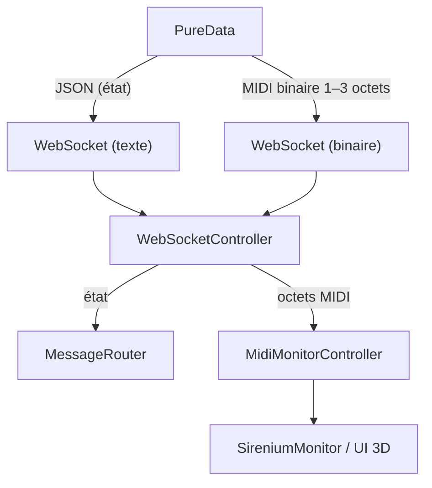

# PedalierSirenium 🎵

**Interface de contrôle 3D Qt6/QML pour 7 sirènes musicales via WebSocket**

[](https://www.qt.io/)
[](https://webassembly.org/)
[](LICENSE)

## 📋 Table des Matières

- [🎵 Vue d'ensemble](#-vue-densemble)
- [🚀 Installation Rapide](#-installation-rapide)
- [🏗️ Architecture](#-architecture)
- [📡 Protocole WebSocket](#-protocole-websocket)
- [🎛️ Configuration](#-configuration)
- [🎬 Contrôle des Boucles](#-contrôle-des-boucles)
- [💾 Gestion des Presets](#-gestion-des-presets)
- [🎭 Gestion des Scènes](#-gestion-des-scènes)
- [📊 Monitoring & Debug](#-monitoring--debug)
- [🔧 Scripts & Outils](#-scripts--outils)
- [📚 Documentation](#-documentation)
- [🗺️ Diagrammes](#%EF%B8%8F-diagrammes)

---

## 🎵 Vue d'ensemble

PedalierSirenium est une **interface de contrôle 3D** développée en Qt6/QML pour la gestion de **7 sirènes musicales** via WebSocket. L'application offre un contrôle temps réel avec visualisation 3D, monitoring avancé et panneau de debug intégré.

### ✨ Fonctionnalités principales
- **🎛️ Contrôle en temps réel** : 7 sirènes via 8 pédales
- **🎨 Interface 3D interactive** : Visualisation des états avec animations
- **💾 Système de presets** : Sauvegarde/chargement/gestion
- **📊 Monitoring système** : Température, performance, WebSocket en temps réel
- **🐛 Debug panel** : Filtrage par catégories avec 11 types de logs
 - **🎬 Animations de boucles** : 4 états visuels (recording, playing, stopped, cleared)
- **🌐 Déploiement web** : WebAssembly avec serveur Node.js

---

## 🚀 Installation Rapide

### Prérequis
- **Qt 6.10+** avec WebAssembly support
- **CMake 3.16+**
- **Emscripten SDK** (pour le build web)
- **Node.js** (pour le serveur local)

### 🎯 Démarrage en 3 étapes

#### 1. **Build et déploiement web (Recommandé)**
```bash
./scripts/build_run_web.sh
```
- ✅ Compile l'application en WebAssembly
- ✅ Lance un serveur Node.js sur `http://localhost:8010`
- ✅ Ouvre automatiquement Google Chrome

#### 2. **Téléchargement WASM uniquement**
```bash
./scripts/download_wasm.sh
```
- 📥 Télécharge le fichier WASM (~36MB) depuis Google Drive
- 🔄 Gestion automatique des tokens de confirmation
- ✅ Vérifications d'intégrité

#### 3. **Build local (développement)**
```bash
cd QtFiles
mkdir build && cd build
cmake ..
make
./qmlwebsocketserver
```

### 🎮 Utilisation
1. **Interface 3D** : 7 sirènes avec animations temps réel
2. **Configuration** : 8 pédales × 7 sirènes × 9 contrôleurs = 504 paramètres
3. **Debug Panel** : `F12` ou bouton ⚙️ (monitoring, logs, performance)
4. **Presets** : Sauvegarde/chargement dans l'interface

---

## 🏗️ Architecture

### 📁 Structure du Projet
```
pedalierSirenium/
├── 📄 README.md                    # Documentation principale
├── 🔧 scripts/                     # Scripts de build et déploiement
│   ├── build_run_web.sh           # Build WebAssembly + serveur Node.js
│   ├── download_wasm.sh           # Téléchargement WASM depuis Google Drive
│   ├── start.pedalier.sh          # Démarrage application pédalier
│   ├── start.pupitre.sh           # Démarrage pupitre de contrôle
│   ├── rtpmidi_connect.sh         # Connexion RTP-MIDI
│   └── README_monitoring.md       # Documentation monitoring Raspberry Pi
├── 🌐 webfiles/                    # Déploiement WebAssembly
│   ├── qmlwebsocketserver.html    # Interface web générée
│   ├── qmlwebsocketserver.js      # Application compilée JavaScript
│   ├── qmlwebsocketserver.wasm    # Binaire WebAssembly (36MB)
│   ├── qtloader.js                # Chargeur Qt pour WASM
│   ├── server.js                  # Serveur HTTP local (port 8010)
│   └── config.js                  # Configuration partagée
├── 🎵 pd/                         # Patches Pure Data
│   └── testQtSocketWidget.pd      # Test WebSocket et intégration
└── 🏗️ QtFiles/                    # Sources Qt6/QML principales
    ├── main.cpp                   # Point d'entrée C++
    ├── CMakeLists.txt            # Configuration CMake
    ├── data.qrc                  # Ressources Qt
    └── qml/                      # Architecture QML complète
        ├── icons/                # 19 icônes interface
        ├── utils/                # Composants 3D réutilisables
        └── qmlwebsocketserver/   # Application principale
            ├── main.qml          # Window principale + View3D
            ├── components/       # Composants UI modulaires
            ├── controllers/      # Logique métier et communication
            └── utils/           # Utilitaires application
```

### 📁 Détail des sous-dossiers QML
```
QtFiles/qml/
└── qmlwebsocketserver/
    ├── main.qml
    ├── Settings.qml
    ├── config.js
    ├── utils/
    │   └── Logger.qml
    ├── controllers/
    │   ├── BeatController.qml
    │   ├── MessageParser.qml
    │   ├── MessageRouter.qml
    │   ├── PedalConfigController.qml
    │   ├── SirenController.qml
    │   ├── WebSocketController.qml
    │   └── MidiMonitorController.qml
    ├── components/
    │   ├── core/
    │   │   ├── CategoryRow.qml
    │   │   ├── SirenColumn.qml
    │   │   └── SirenView.qml
    │   ├── controls/
    │   │   ├── ComboBox3D.qml
    │   │   ├── ControlSection.qml
    │   │   ├── PedalConfigPanel.qml
    │   │   ├── PedalPresetManager.qml
    │   │   ├── SceneButton.qml
    │   │   ├── SceneGrid.qml
    │   │   ├── SceneInfo.qml
    │   │   ├── SceneManager.qml
    │   │   ├── SceneNavigation.qml
    │   │   ├── SceneSaveDialog.qml
    │   │   └── TempoControl.qml
    │   ├── debug/
    │   │   └── DebugPanel.qml
    │   ├── monitoring/
    │   │   ├── PerformanceMonitor.qml
    │   │   ├── PieChartAnimation.qml
    │   │   ├── RevolutionCounter3D.qml
    │   │   ├── SireniumMonitor.qml
    │   │   ├── SirenStateMonitor.qml
    │   │   ├── midi-display/
    │   │   │   ├── SirenChannelMonitor3D.qml
    │   │   │   ├── MusicalStaff3D.qml
    │   │   │   ├── StaffClef3D.qml
    │   │   │   ├── NoteMarker3D.qml
    │   │   │   ├── VelocityBar3D.qml
    │   │   │   ├── BendMeter3D.qml
    │   │   │   ├── NoteHistoryTrail3D.qml
    │   │   │   └── SirenSpecProvider.qml
    │   │   └── SystemInfoReader.qml
    │   └── ui/
    │       ├── BottomControls.qml
    │       ├── ConfigModeButton.qml
    │       ├── ConnectionStatus.qml
    │       └── ScenePageIndicator.qml
    └── icons/ (png)
    
QtFiles/qml/qmlwebsocketserver/
└── sirenSpec.json (configuration des clés/ambitus/canaux par sirène)

QtFiles/qml/utils/
└── (3D helpers)
    ├── DigitLED3D.qml
    ├── Knob.qml
    ├── Knob3D.qml
    ├── LEDSegment.qml
    └── LEDText3D.qml
```

### 🎛️ Couche de Contrôleurs (Business Logic)
- **[WebSocketController](QtFiles/qml/qmlwebsocketserver/controllers/WebSocketController.qml)** : Communication WebSocket avec routage automatique
- **[PedalConfigController](QtFiles/qml/qmlwebsocketserver/controllers/PedalConfigController.qml)** : Gestion matrice 8×7×9 avec presets
- **[SirenController](QtFiles/qml/qmlwebsocketserver/controllers/SirenController.qml)** : Contrôle des 7 sirènes 3D
- **[BeatController](QtFiles/qml/qmlwebsocketserver/controllers/BeatController.qml)** : Synchronisation temporelle et animations
- **[MessageRouter](QtFiles/qml/qmlwebsocketserver/controllers/MessageRouter.qml)** : Routage intelligent des messages par batch
- **[MessageParser](QtFiles/qml/qmlwebsocketserver/controllers/MessageParser.qml)** : Parsing JSON et aplatissement en chemins hiérarchiques

### 🖼️ Interface Utilisateur 3D
- **[SirenView](QtFiles/qml/qmlwebsocketserver/components/core/SirenView.qml)** : Vue 3D principale avec 7 sirènes
- **[PedalConfigPanel](QtFiles/qml/qmlwebsocketserver/components/controls/PedalConfigPanel.qml)** : Matrice de configuration interactive 8×7×9
- **[SceneManager](QtFiles/qml/qmlwebsocketserver/components/controls/SceneManager.qml)** : Interface de gestion des scènes (grille 2×4, navigation pages)
- **[DebugPanel](QtFiles/qml/qmlwebsocketserver/components/debug/DebugPanel.qml)** : Panneau debug complet avec 3 onglets

---

## 📡 Protocole WebSocket (hybride)

### 🔗 URL de connexion
```
ws://localhost:10000
```

### 🧭 Canaux de transport
- **Texte (JSON)**: monitoring et état applicatif (boucles, scènes, voix, presets, horloge agrégée).
- **Binaire (1–3 octets)**: événements MIDI temps réel (clock 0xF8/FA/FB/FC, Note On/Off, CC, Pitch Bend).

Cette séparation minimise la latence pour les événements MIDI tout en gardant un monitoring lisible et extensible.

### 📤 Messages envoyés par le client (JSON)

#### 🎛️ Configuration des pédales
```json
{
  "device": "SIREN_PEDALS",
  "pedalConfigChange": {
    "pedalId": 1,
    "sirenId": 2, 
    "controller": "vibratoSpeed",
    "value": -50
  }
}
```

#### 💾 Gestion des presets
```json
{
  "device": "SIREN_PEDALS",
  "action": "savePreset",
  "presetName": "nom_du_preset"
}
```

#### 🎭 Gestion des scènes
```json
{
  "device": "LOOPER_SCENES",
  "action": "getScenesList"
}
```

### 📥 Messages reçus du serveur (JSON)

#### 🎵 État des boucles et sirènes
```json
{
  "device": "SIREN_LOOPER",
  "loops": {
    "main_loop": 1,
    "states": [
      {
        "siren_id": 1,
        "transport": "playing",
        "current_bar": 3,
        "loopSize": 8,
        "revolutions": 42
      }
    ]
  },
  "sirenPings": {
    "siren1": 1,
    "siren2": 0,
    "siren3": 1,
    "siren4": 1,
    "siren5": 0,
    "siren6": 1,
    "siren7": 1
  },
  "clock": {
    "bpm": 120,
    "beat": 1,
    "bar": 3
  }
}
```

Exemple (optionnel) avec `sirenStates` minimal:
```json
{
  "device": "SIREN_LOOPER",
  "sirenStates": {
    "siren1": { "pitch": 60, "velocity": 0 },
    "siren2": { "pitch": 64, "velocity": 90 }
  }
}
```

#### 🟢 Structure `sirenPings`

- **Objet** dont les clés sont `siren1` à `siren7`.
- Valeur pour chaque clé: `1` (ok) ou `0` (pas ok). Les valeurs booléennes `true/false` sont aussi acceptées.

Exigences côté client (QML):
- `DebugPanel` transmet `currentMonitoringData.sirenPings` à `SirenStateMonitor` via la propriété `sirenPings`.
- `SirenStateMonitor` colore l’indicateur en début de ligne selon `sirenPings`:
  - Vert `#4CAF50` si 1/true.
  - Orange `#FF5722` sinon.

Recommandation côté serveur (PureData/WS JSON):
- Rafraîchir `sirenPings` à intervalle régulier (ex: 1s).
- Calculer `pingOk` côté serveur selon votre logique (timeout, watchdog, etc.).

### 🎹 Frames binaires MIDI (serveur → client)

- Horloge: 1 octet
  - `0xF8` Clock tick (24 ppq)
  - `0xFA` Start, `0xFB` Continue, `0xFC` Stop
- Messages canal: 3 octets `[status, data1, data2]`
  - Note On: `0x9n, note, velocity (>0)`
  - Note Off: `0x8n, note, 0` (ou `0x9n, note, 0`)
  - Control Change: `0xBn, controller, value`
  - Pitch Bend: `0xEn, lsb, msb` → valeur 14 bits `(msb<<7)|lsb`

où `n` est le numéro de canal (0–15).

#### PureData → WebSocket: format et envoi

- Chaque événement MIDI est expédié dans une frame WebSocket binaire contenant exactement 1, 2 ou 3 octets.
- Recommandation: 1 événement par frame, sans JSON ni séparateur.

Encodage typique:
- Note On canal `n` (note `nn`, vélocité `vv`>0): `[0x90|n, nn, vv]`
- Note Off canal `n` (note `nn`): `[0x80|n, nn, 0]` (ou `[0x90|n, nn, 0]`)
- Control Change canal `n`: `[0xB0|n, cc, value]`
- Pitch Bend canal `n` (14 bits):
  - côté source: scinder `bend` (0..16383) en `lsb = bend & 0x7F`, `msb = (bend >> 7) & 0x7F`
  - envoyer `[0xE0|n, lsb, msb]`
- Clock temps réel: une frame d’un seul octet `0xF8` à 24 ppq; `0xFA` start, `0xFB` continue, `0xFC` stop.

Remarque: PureData doit ouvrir une connexion WebSocket sur `ws://localhost:10000` et envoyer des frames binaires (non texte). Aucune concaténation ni timestamp requis côté client.

### 🎼 Spécification des sirènes (sirenSpec)

- But: décrire, par sirène, la clé de portée, l'ambitus (notes MIDI min/max), la transposition, la couleur, le canal, et les métadonnées de bend spécifiques au dispositif.
- Emplacement fichier (option): `QtFiles/qml/qmlwebsocketserver/sirenSpec.json`
- Chargement dynamique (option): via WebSocket texte

Note sur le pitch bend par sirène:
- Certaines sirènes utilisent un bend non standard codé sur 13 bits, avec centre 4096 et plage ±4096.
- On n'impose pas d'unité “par demi‑ton” dans le spec; la conversion/maths est laissée au traitement applicatif pour garantir une transition continue entre les demi‑tons.

Exemple `sirenSpec.json` minimal:
```json
{
  "meta": {
    "bendBits": 13,
    "bendCenter": 4096
  },
  "siren1": {
    "label": "S1",
    "channel": 0,
    "clef": "treble",
    "ambitus": { "min": 48, "max": 84 },
    "transpose": 0,
    "color": "#4CAF50"
  },
  "siren2": {
    "label": "S2",
    "channel": 1,
    "clef": "alto",
    "ambitus": { "min": 45, "max": 81 },
    "transpose": 0,
    "color": "#03A9F4"
  }
}
```

Exemple chargement par WebSocket:
```json
{
  "device": "SIREN_SPEC",
  "spec": {
    "meta": { "bendBits": 13, "bendCenter": 4096 },
    "siren1": { "label": "S1", "channel": 0, "clef": "treble", "ambitus": { "min": 48, "max": 84 }, "transpose": 0, "color": "#4CAF50" }
  }
}
```

### 🕒 Quantification rythmique et rendu sur portée

- Source temporelle: horloge MIDI temps réel `0xF8` à 24 ppq (pulses per quarter note). Start `0xFA`, Continue `0xFB`, Stop `0xFC`.
- Détection d’événements: NoteOn/NoteOff collectés avec timestamp (ticks), conversion en durées musicales à partir de BPM et PPQ.
- Grille de quantification: noire, croche, double‑croche; option triolet (groupes de 3 au ratio ≈ 2/3 d’un temps).
- Rendu simplifié: rondes, blanches, noires, croches, doubles; beams simples; triolets basiques (accolade « 3 »).
- Données internes (par sirène): tampon d’événements `{t, note, velocity, bend}` en ticks; après quantif: `{bar, beat, pos, duration, figure, triplet?}`.

Exemple JSON d’événements quantifiés (une sirène):
```json
{
  "device": "SIREN_NOTATION",
  "sirenId": 4,
  "time": { "bpm": 120, "ppq": 24, "signature": "4/4" },
  "measures": 2,
  "notes": [
    { "bar": 1, "beat": 1, "pos": 0.0,  "duration": 1.0,  "figure": "quarter", "note": 60, "velocity": 90 },
    { "bar": 1, "beat": 2, "pos": 0.0,  "duration": 0.5,  "figure": "eighth",  "note": 62, "velocity": 88 },
    { "bar": 1, "beat": 2, "pos": 0.5,  "duration": 0.5,  "figure": "eighth",  "note": 64, "velocity": 85 },
    { "bar": 1, "beat": 3, "pos": 0.0,  "duration": 0.333, "figure": "eighth",  "triplet": true, "note": 65, "velocity": 80 },
    { "bar": 1, "beat": 3, "pos": 0.333, "duration": 0.333, "figure": "eighth",  "triplet": true, "note": 67, "velocity": 82 },
    { "bar": 1, "beat": 3, "pos": 0.666, "duration": 0.333, "figure": "eighth",  "triplet": true, "note": 69, "velocity": 84 },
    { "bar": 1, "beat": 4, "pos": 0.0,  "duration": 2.0,  "figure": "half",    "note": 67, "velocity": 78 }
  ]
}
```

Remarques:
- `pos` et `duration` sont exprimés en fractions de temps (1.0 = une noire en 4/4). Les valeurs triolets ≈ 0.333 peuvent être arrondies à l’affichage.
- La détection/quantification est appliquée côté client à partir des timestamps et de l’horloge reçue.

#### Test rapide (build + logs navigateur)

1) Build et lancement (ouvre le navigateur, démarre le serveur de logs):
```bash
./scripts/build_run_web.sh
```

2) Consulter les logs navigateur collectés côté serveur:
```bash
tail -n 120 /tmp/webfiles_server.log | sed -e 's/\x1b\[[0-9;]*m//g' | tail -n 120
# ou en JSON:
curl -s http://localhost:8010/logs | jq . | tail -n 80
```

Vous devriez voir:
- "Web MIDI API: disponible" (message côté page hôte, informatif)
- "WASM: écoute via WebSocket binaire (pas de Web MIDI en QML)"
- Messages SCENES/WEBSOCKET et, lorsque PD envoie du binaire, aucun log bavard (chemin hot‑path allégé)

##### Agrégation des logs MIDI
- Résumé périodique toutes les 1000 ms: `MIDI résumé 1000ms: <count> dernière: <hex>`
- Logs par événement détaillés uniquement au niveau TRACE (désactivé par défaut)

#### 📋 Liste des scènes
```json
{
  "device": "LOOPER_SCENES",
  "batch": "scenesList",
  "scenes": [
    {
      "page": 1,
      "sceneId": 1,
      "globalSceneId": 1,
      "sceneName": "intro",
      "isEmpty": false,
      "isActive": false
    }
  ]
}
```

---

## 🎛️ Configuration

### 🎛️ Structure des données
Chaque sirène peut être contrôlée par **9 paramètres** transmis sous forme de tableau à plat :

```json
"controllers": [vibratoSpeed, vibratoDepth, vibratoProgression, tremoloSpeed, tremoloDepth, attack, release, tune, voice]
```

#### 🎛️ Paramètres (dans l'ordre)
Les valeurs représentent des **pourcentages de modulation** de **-100 à +100** :

1. **volume** : Contrôle du volume (-100% à +100%)
2. **vibratoSpeed** : Modulation vitesse du vibrato (-100% à +100%)
3. **vibratoDepth** : Modulation profondeur du vibrato (-100% à +100%)
4. **tremoloSpeed** : Modulation vitesse du tremolo (-100% à +100%)
5. **tremoloDepth** : Modulation profondeur du tremolo (-100% à +100%)
6. **attack** : Modulation temps d'attaque (-100% à +100%)
7. **release** : Modulation temps de relâchement (-100% à +100%)
8. **voice** : Modulation accord (-12demi-tons à +12demi-tons)

### 🧮 Matrice de configuration
- **8 pédales** (pedalId: 1-8)
- **7 sirènes** par pédale (sirenId: 1-7)
- **8 contrôleurs** par sirène (volume, vibratoSpeed, vibratoDepth, tremoloSpeed, tremoloDepth, attack, release, tune)

**Total : 8 × 7 × 8 = 448 paramètres configurables**

---

## 🎬 Contrôle des Boucles

### 🎬 Messages WebSocket pour contrôler les boucles

#### 🔴 Démarrer l'enregistrement
```json
{
  "device": "SIREN_LOOPER",
  "loops": {
    "states": [{
      "siren_id": 1,
      "transport": "recording",
      "current_bar": 1
    }]
  }
}
```

#### 🟢 Démarrer la lecture
```json
{
  "device": "SIREN_LOOPER",
  "loops": {
    "states": [{
      "siren_id": 1,
      "transport": "playing",
      "current_bar": 1,
      "loopSize": 4,
      "revolutions": 0
    }]
  }
}
```

#### ⚫ Effacer la boucle (cleared)
```json
{
  "device": "SIREN_LOOPER",
  "loops": {
    "states": [{
      "siren_id": 1,
      "transport": "cleared"
    }]
  }
}
```

### 🎯 États de Transport Supportés

| État | Description | Effet Visuel |
|------|-------------|--------------|
| `"recording"` | Enregistrement en cours | 🔴 Anneau rouges avec pulse |
| `"playing"` | Boucle en cours de lecture | 🟢 Animation circulaire verte |
| `"stopped"` | Boucle en pause temporaire | 🟡 Anneau coloré en vert fixe |
| `"cleared"` | Boucle effacée/supprimée | ⚫ Anneau inactif (gris) |

---

## 💾 Gestion des Presets

### 💾 Messages WebSocket pour la gestion des presets

#### 💾 Sauvegarder un preset
```json
{
  "device": "SIREN_PEDALS",
  "action": "savePreset",
  "presetName": "mon_preset"
}
```

#### 💾 Charger un preset
```json
{
  "device": "SIREN_PEDALS",
  "action": "loadPreset",
  "presetName": "mon_preset"
}
```

#### 💾 Supprimer un preset
```json
{
  "device": "SIREN_PEDALS",
  "action": "deletePreset",
  "presetName": "mon_preset"
}
```

#### 💾 Obtenir la liste des presets
```json
{
  "device": "SIREN_PEDALS",
  "action": "getPresetList"
}
```

#### 💾 Obtenir le preset actuel
```json
{
  "device": "SIREN_PEDALS",
  "action": "getCurrentPreset"
}
```

---

## 🎭 Gestion des Scènes

### 🎭 Messages WebSocket pour la gestion des scènes

#### 🎭 Obtenir la liste des scènes
```json
{
  "device": "LOOPER_SCENES",
  "action": "getScenesList"
}
```

#### 🎭 Charger une scène
```json
{
  "device": "LOOPER_SCENES",
  "action": "loadScene",
  "sceneId": 1
}
```

#### 🎭 Sauvegarder une scène
```json
{
  "device": "LOOPER_SCENES",
  "action": "saveScene",
  "sceneId": 1,
  "sceneName": "ma_scene"
}
```

#### 🎭 Supprimer une scène
```json
{
  "device": "LOOPER_SCENES",
  "action": "deleteScene",
  "sceneId": 1
}
```

---

## 📊 Monitoring & Debug

### 🌡️ Informations Système

**✅ Nouveau :** Les informations système sont obtenues via des requêtes HTTP REST vers le serveur Node.js, qui lit directement les données système en temps réel.

#### 🔧 API REST du serveur Node.js
Le serveur `webfiles/server.js` expose deux endpoints pour les informations système :

```bash
# Température CPU uniquement
GET http://192.168.1.21:8010/api/temperature
# Réponse: {"temperature": 45.2}

# Informations système complètes (lecture directe)
GET http://192.168.1.21:8010/api/system-info
# Réponse: {"temperature":45.2,"cpu":33.3,"memory":38.5,"uptime":72.90,"network":"RX:663669 TX:111165"}
```

**⚠️ Note :** Les informations de performance ne sont pas gérées par le serveur WebSocket mais par l'API REST ci-dessus.

#### 📝 Configuration requise
1. **Serveur Node.js** : Le serveur doit être démarré sur le Raspberry Pi
2. **IP du serveur** : Configurer l'IP du Raspberry Pi dans `SystemInfoReader.qml`
3. **Permissions** : Le serveur Node.js doit pouvoir exécuter les commandes système

#### ✅ Avantages de cette approche
- ✅ **Accès distant** : Fonctionne depuis n'importe où via IP
- ✅ **API REST** : Facile à tester et debugger
- ✅ **Temps réel** : Données fraîches à chaque requête
- ✅ **Pas de fichiers** : Plus besoin de scripts cron ou de logs
- ✅ **Extensible** : Peut ajouter d'autres endpoints facilement
- ✅ **Performance** : Requêtes HTTP optimisées toutes les 5 secondes

### 🐛 Système de debug

#### 📊 Interface de Monitoring (DebugPanel)
Le monitoring est accessible via le **DebugPanel** (`F12`) avec 3 sections :

- **🐛 Debug** : Logs par catégories avec filtres
- **📊 Monitoring** : État des sirènes (pings via `sirenPings`) et superposition MIDI live (note/vélocité) dans `SirenStateMonitor` + options d’affichage
- **⚡ Performance** : Température CPU, performance système, WebSocket

#### 📊 Catégories de logs
- **WEBSOCKET** 🌐 : Communication WebSocket
- **PRESET** 💾 : Gestion des presets
- **KNOB** 🎛️ : Interactions avec les contrôleurs
- **ANIMATION** 🎬 : Animations 3D et visuelles
- **ROUTER** 🔀 : Routage des messages
- **PARSER** 📝 : Parsing des données
- **SCENE** 🎭 : Gestion des scènes (sauvegarde, chargement, navigation)
- **BATCH** 📦 : Traitement des messages batch (scenesList, sceneLoaded, etc.)
- **INIT** 🚀 : Initialisation des composants

#### 📊 Niveaux de logs
- **0** : OFF (désactivé)
- **1** : ERROR (erreurs uniquement)
- **2** : WARN (avertissements et erreurs)
- **3** : INFO (informations, avertissements et erreurs)
- **4** : DEBUG (tout, y compris debug détaillé)

---

## 🔧 Scripts & Outils

### 🚀 Scripts de déploiement

| Script | Description | Usage |
|--------|-------------|-------|
| **[build_run_web.sh](scripts/build_run_web.sh)** | Build WebAssembly + serveur Node.js | `./scripts/build_run_web.sh` |
| **[download_wasm.sh](scripts/download_wasm.sh)** | Téléchargement WASM depuis Google Drive | `./scripts/download_wasm.sh` |
| **[start.pedalier.sh](scripts/start.pedalier.sh)** | Démarrage application pédalier | `./scripts/start.pedalier.sh` |
| **[start.pupitre.sh](scripts/start.pupitre.sh)** | Démarrage pupitre de contrôle | `./scripts/start.pupitre.sh` |
| **[rtpmidi_connect.sh](scripts/rtpmidi_connect.sh)** | Connexion RTP-MIDI | `./scripts/rtpmidi_connect.sh` |

### 📊 Monitoring Raspberry Pi

| Fichier | Description |
|---------|-------------|
| **Serveur Node.js** | `webfiles/server.js` - API REST pour les données système |
| **Endpoints** | `/api/temperature` et `/api/system-info` |

### 🎵 Test et intégration

| Fichier | Description |
|---------|-------------|
| **[testQtSocketWidget.pd](pd/testQtSocketWidget.pd)** | Patch Pure Data pour test WebSocket |

---

## 📚 Documentation

### 📖 Documentation détaillée
- **[Protocole WebSocket complet](#-protocole-websocket)** : Messages, formats, exemples
- **[Configuration des contrôleurs](#-configuration)** : Structure des données, matrice
- **[Contrôle des boucles](#-contrôle-des-boucles)** : États, messages, animations
- **[Gestion des presets](#-gestion-des-presets)** : Sauvegarde, chargement, suppression
- **[Gestion des scènes](#-gestion-des-scènes)** : Navigation, sauvegarde, chargement
- **[Monitoring et debug](#-monitoring--debug)** : Scripts, logs, interface

### 🔗 Liens utiles
- **[Architecture du projet](#-architecture)** : Structure, composants, contrôleurs
- **[Scripts et outils](#-scripts--outils)** : Déploiement, monitoring, test
- **[Installation rapide](#-installation-rapide)** : Prérequis, démarrage

### 🆘 Support
- **Debug Panel** : `F12` dans l'application
- **Logs** : 11 catégories avec 5 niveaux de verbosité
- **Monitoring** : Script automatique pour Raspberry Pi 5

---

## 🗺️ Diagrammes

Les diagrammes explicatifs sont dans `docs/`:

- [docs/architecture_communication.md](docs/architecture_communication.md)
- [docs/ui_flow.md](docs/ui_flow.md)

Aperçu rapide de l’architecture de communication:



## 🎛️ SireniumMonitor : Monitoring MIDI en temps réel

Le composant `SireniumMonitor` affiche en temps réel la note, la vélocité et le pitch bend reçus du Sirénium, sous forme de digits LED 3D colorés (basé sur `DigitLED3D`).

- **Affichage** :
  - Note (2 digits, rouge)
  - Vélocité (3 digits, turquoise)
  - Bend (4 digits, bleu)
- **Emplacement** :
  - Placé juste au-dessus de la barre de contrôles (`BottomControls`) dans la fenêtre principale.
- **Connexion** :
  - Les propriétés `note`, `velocity` et `bend` sont mises à jour automatiquement via les messages MIDI reçus par WebSocket.

### Exemple d'intégration (main.qml)
```qml
SireniumMonitor {
    id: sireniumMonitor
    anchors.left: parent.left
    anchors.right: parent.right
    anchors.bottom: bottomControls.top
    anchors.bottomMargin: 12
    height: 120
    note: midiNote
    velocity: midiVelocity
    bend: midiBend
}
```

### Connexion aux données MIDI
Dans le contrôleur WebSocket ou le handler de réception MIDI, mettez à jour les propriétés :
```qml
// Exemple générique
onMidiMessageReceived: function(note, velocity, bend) {
    midiNote = note;
    midiVelocity = velocity;
    midiBend = bend;
}
```

Le composant permet ainsi un monitoring visuel élégant et immédiat de l'activité MIDI du Sirénium.

---

## 📋 TODO — Communication hybride (JSON + MIDI binaire)

### ✅ Phase 1 — Architecture et protocole
- [x] Abandon définitif de `qmlmidi` (Qt plugin) pour compatibilité WASM
- [x] PureData = source unique des événements via WebSocket
- [x] Node local: sert fichiers + collecte logs navigateur (aucun WebSocket émis)
- [x] Définition du protocole hybride: JSON (monitoring) + binaire (MIDI)
- [x] Documentation des frames binaires MIDI (1–3 octets)

### ✅ Phase 2 — Intégration QML
- [x] `WebSocketController.qml`: handler `onBinaryMessageReceived` → `MidiMonitorController`
- [x] `MidiMonitorController.qml`: `applyExternalMidiBytes/status` + signal `midiDataChanged`
- [x] Résumé logs MIDI (1000ms), pas de logs par événement (TRACE uniquement)
- [x] JSON monitoring (`sirenPings`/`sirenStates`) routé via `monitoringDataReceived`
- [x] Affichage du nom de note dans `SireniumMonitor` (entre NOTE et VEL) pour le debug

### 🧩 Phase 3 — Monitoring par sirène (portée 3D dans SirenView)
- [x] Intégrer `midi-display/` dans `SirenView` via `SirenChannelMonitor3D` (1 panneau par sirène)
- [x] Câblage MIDI par canal vers chaque `SirenColumn` (`applyMidi(note, velocity, bend, channel)`)
- [x] Utiliser `sirenSpec` (clé, ambitus, transpose, canal, couleur) via `SirenSpecProvider` (WASM-safe)
- [ ] Afficher la note sur la portée avec `MusicalStaff3D` + `NoteMarker3D` (mapping vertical précis clef/ambitus; bend 13 bits centre=4096)
- [x] Afficher la vélocité (`VelocityBar3D`) et le pitch bend (`BendMeter3D`, centre=4096)
- [ ] Mode historique focus (clic sur la portée):
  - [ ] Masquer les autres portées, afficher une portée étendue paramétrable (`measuresCount`)
  - [ ] Alimenter l’historique (tampon borné) et rendu par `NoteHistoryTrail3D`
  - [ ] Porte de sortie claire: clic de retour, bouton fermer, touche Esc
- [ ] Prise en compte de l’horloge (24 ppq) pour la quantification et l’alignement temporel (figures simples + triolets)
- [ ] `SireniumMonitor` reste dédié au résumé; exception temporaire: affichage du nom de note (debug)

#### Prochaines étapes immédiates (Phase 3)
- Finaliser le mapping note→Y sur la portée selon `clef` et `ambitus` (transposition incluse)
- Appliquer la courbe de `pitch bend` (13 bits, centre 4096) au déplacement continu du `NoteMarker3D`

#### Retours d’expérience (V1 clé de sol en texture)
- Tentative V1: `Shape` 2D → `Texture` → quad 3D (clé de sol) → trop fragile sous WASM (alpha/blend, primitives `#Plane` non dispo).
- Effets observés: bande opaque, besoins d’offsets énormes (mismatch d’échelle), erreurs `alphaMode/transparencyMode` dépendant des matériaux.
- Décision: retirer la clé de sol (temporaire) et basculer vers V2 (SDF/shader) pour un rendu net et robuste sans quad texturé.

### 🎼 Phase 4 — Partition Interactive
- [ ] Intégrer la quantification (24 ppq) et produire des données `{bar, beat, pos, duration, figure, triplet?}` par sirène
- [ ] Rendu des figures simples (ronde, blanche, noire, croche, double) + triolets basiques
- [ ] Groupes de croches (beams) simples par temps
- [ ] Interaction tactile: bascule focus historique, réglage `measuresCount`, navigation mesures

### 🔧 Phase 5 — Optimisation et Tests
- [ ] Latence et charge: validation hot‑path (binaire), cadencement UI, coûts rendu 3D
- [ ] Compatibilité: tests Linux/macOS/Web
- [ ] Doc finale: captures, exemples JSON (sirenSpec, notation), guide d’intégration

---

## ✅ Statut du Projet

- ✅ **Interface 3D** : Vue des 7 sirènes avec animations
- ✅ **Contrôle en temps réel** : 504 paramètres configurables
- ✅ **Système de presets** : Sauvegarde/chargement/gestion
- ✅ **Gestion des scènes** : 64 scènes (8 pages × 8 scènes)
- ✅ **Monitoring système** : Température, CPU, RAM, WebSocket
- ✅ **Debug panel** : Interface complète avec filtres
- ✅ **Déploiement web** : WebAssembly avec serveur Node.js
- ✅ **Documentation** : README complet avec exemples

---

**🎵 PedalierSirenium** - Interface de contrôle 3D pour sirènes musicales via WebSocket 