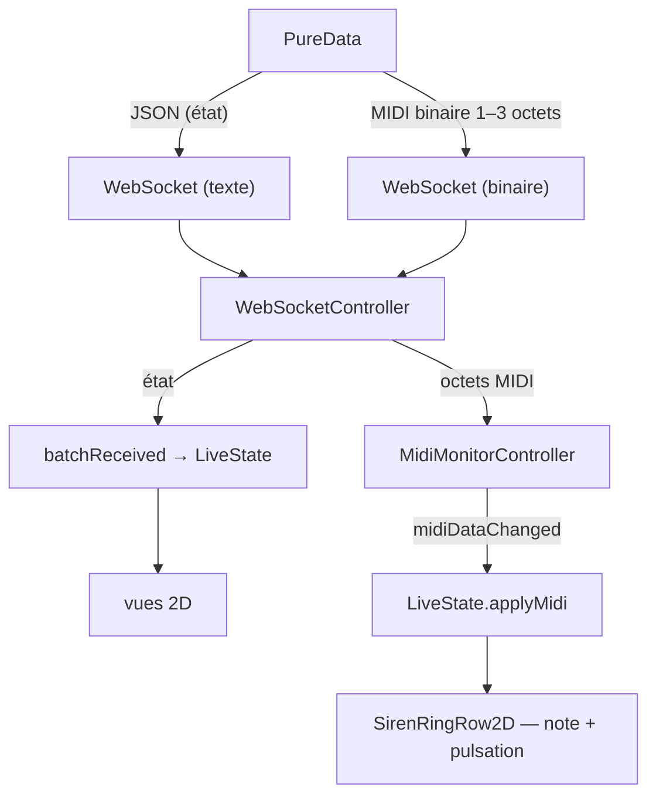

# PedalierSirenium 🎵

**Afficheur de looper Qt6/QML pour 7 sirènes musicales, piloté par PureData via WebSocket**

[](https://www.qt.io/)
[](https://webassembly.org/)
[](LICENSE)

## 📋 Table des Matières

- [🎵 Vue d'ensemble](#-vue-densemble)
- [🚀 Installation Rapide](#-installation-rapide)
- [🏗️ Architecture](#-architecture)
- [📡 Protocole WebSocket](#-protocole-websocket)
- [🎛️ Configuration](#-configuration)
- [🎬 Contrôle des Boucles](#-contrôle-des-boucles)
- [💾 Gestion des Presets](#-gestion-des-presets)
- [🎭 Gestion des Scènes](#-gestion-des-scènes)
- [📊 Monitoring & Debug](#-monitoring--debug)
- [🔧 Scripts & Outils](#-scripts--outils)
- [📚 Documentation](#-documentation)
- [🗺️ Diagrammes](#%EF%B8%8F-diagrammes)

---

## 🎵 Vue d'ensemble

PedalierSirenium est l'**afficheur du looper** : une interface 2D Qt6/QML pour **7 sirènes musicales** et 8 pédales, entièrement pilotée par PureData via WebSocket. Elle ne décide de rien — **PureData est la source de vérité à l'exécution** ; l'application affiche l'état qu'il lui pousse.

Depuis la refonte 2D, la scène Quick3D a disparu : plus de `View3D`, plus de composants 3D. La règle d'affichage retenue est **la couleur dit qui, la forme dit quoi** — la couleur reste réservée à l'identité des sirènes.

### ✨ Fonctionnalités principales
- **🎛️ Affichage temps réel** : 7 sirènes × 8 pédales, 8 contrôleurs par croisement
- **🎬 Boucles** : état de transport et paliers d'atterrissage par sirène
- **🎭 Scènes et morceaux** : grille de scènes, morceau chargé, banques
- **🎹 Sirenium** : note tenue, position du curseur sur l'ambitus, volet obturateur
- **🌐 Déploiement web** : WebAssembly + serveur Node.js (cible de livraison)

La cible finale est **WebAssembly dans un navigateur** ; les builds desktop n'existent que pour la vitesse de développement.

---

## 🚀 Installation Rapide

### Prérequis
- **Qt 6.10+** avec WebAssembly support
- **CMake 3.16+**
- **Emscripten SDK** (pour le build web)
- **Node.js** (pour le serveur local)

### 🎯 Démarrage en 3 étapes

#### 1. **Build et déploiement web (Recommandé)**
```bash
./scripts/build_run_web.sh
```
- ✅ Compile l'application en WebAssembly
- ✅ Lance un serveur Node.js sur `http://localhost:8010`
- ✅ Ouvre automatiquement Google Chrome

#### 2. **Téléchargement WASM uniquement**
```bash
./scripts/download_wasm.sh
```
- 📥 Télécharge le fichier WASM (~36MB) depuis Google Drive
- 🔄 Gestion automatique des tokens de confirmation
- ✅ Vérifications d'intégrité

#### 3. **Build local (développement)**
```bash
cd QtFiles
mkdir build && cd build
cmake ..
make
./qmlwebsocketserver
```

### 🎮 Utilisation
1. **Vue de jeu** : boucles, scènes, morceau, sirenium — tout vient de PD
2. **Vue de configuration** : bascule **`CFG`** en haut à droite ; matrice 8 pédales × 7 sirènes ×
   8 contrôleurs = **448 paramètres** (`volume, vibratoSpeed, vibratoDepth, tremoloSpeed,
   tremoloDepth, attack, release, voice`), tous en ±100 % de modulation sauf `voice` (±12 demi-tons)
3. **Source de vérité** : `QtFiles/qml/qmlwebsocketserver/config.js` — pas cette page

> Le panneau de debug n'est plus accessible (`F12` et le bouton engrenage n'ouvrent rien) : voir
> « Ce qui est vivant, ce qui ne l'est pas ». Pour monter le niveau de log, passer par le code :
> `logger.setAllCategories(4)`.

---

## 🏗️ Architecture

### Le principe

**PureData décide, le QML affiche.** L'application n'a aucune pile MIDI propre : PD se connecte à
`ws://localhost:10000` et pousse tout l'état. Rien n'est calculé ici qui puisse l'être là-bas.

`main.qml` câble tout à la main : pas de singleton QML, pas de type C++ enregistré. `main.cpp` est un
`QQmlApplicationEngine` standard. Les contrôleurs reçoivent leurs collaborateurs par propriété — un
oubli échoue silencieusement à l'exécution, pas à la compilation.

### Chaîne de signal

```
WebSocket ─┬─ texte ──→ WebSocketController ──→ batchReceived ──→ switch de main.qml
           │            (lissé à 40 ms par PD)                     └→ LiveState.applyX()
           │                                                          └→ les vues 2D s'y lient
           └─ binaire ─→ MidiMonitorController ──→ midiDataChanged ──→ LiveState.applyMidi
                        (immédiat, non lissé)                          └→ SirenRingRow2D
```

`LiveState.qml` est l'unique objet d'état auquel toute l'interface 2D se lie. Ajouter un type de
message, c'est : une branche `json.device` dans `WebSocketController`, un `case` dans le switch de
`main.qml`, une méthode `applyX` sur `LiveState`. `SimulationHarness.qml` reproduit l'interface de
`LiveState` pour que la vue vive sans PD — garder les deux en phase.

### Structure du projet

```
QtFiles/
├── main.cpp                 # QQmlApplicationEngine + cap ~30 FPS (setSwapInterval(2))
├── CMakeLists.txt           # Core Quick WebSockets — plus de Quick3D
├── data.qrc                 # MANUEL : tout fichier non listé est absent à l'exécution
└── qml/qmlwebsocketserver/
    ├── main.qml             # fenêtre, câblage, switch onBatchReceived
    ├── Settings.qml
    ├── config.js            # URL WebSocket, contrôleurs, ordre d'affichage
    ├── sirenSpec.js         # LE fichier lu (le .json est documentaire)
    ├── components/play/     # la vue de jeu
    ├── components/config/   # la vue CFG
    ├── controllers/         # WebSocketController, MidiMonitorController, MessageParser
    └── utils/Logger.qml
webfiles/                    # cible WASM servie par server.js (port 8010)
deploy/                      # deploiement Mac vers Raspberry Pi
```

### Tout ce qui reste est vivant

La refonte 2D avait laissé une cinquantaine de fichiers en place sans les débrancher. **Les 25
orphelins ont été supprimés** (2026-07) : tout `components/controls/`, `components/monitoring/`,
`components/ui/`, `components/debug/`, `components/core/`, plus `controllers/MessageRouter`,
`controllers/PedalConfigController` et `qml/utils/` (`Knob`, `MusicUtils`, `VirtualKeyboard`). Les
composants de l'ancienne interface 3D (`SirenView`, `SirenColumn`, `SirenController`,
`BeatController`, `SirenSpecProvider`) avaient déjà disparu avant.

Il reste **19 fichiers QML**, tous atteignables depuis `main.qml`. Le wasm est passé de 31,5 à
26,7 Mo au passage (les icônes et textures 3D inutilisées ont quitté `data.qrc` en même temps).

Conséquence : il n'y a **plus de panneau de debug**. L'ancien raccourci `F12` et le bouton engrenage
n'ouvraient déjà plus rien ; la seule bascule est **`CFG`** en haut à droite, qui alterne vue de jeu
et vue de configuration. Pour régler les niveaux de log, passer par le code
(`logger.setAllCategories(4)`).

Si un besoin de panneau revient, le code supprimé reste dans l'historique — le commit
« enregistrer l'état du panneau de debug avant suppression » le fige juste avant.


## 📡 Protocole WebSocket (hybride)

### 🔗 URL de connexion
```
ws://localhost:10000
```

### 🧭 Canaux de transport

Un seul socket, trois canaux **asymétriques** — c'est l'asymétrie qu'il faut retenir :

- **Texte entrant (JSON)** : état applicatif (boucles, scènes, voix, presets, horloge). Dispatché sur
  `json.device` : `SIREN_LOOPER`, `SIREN_PEDALS`, `LOOPER_SCENES`, `SIRENIUM`, `VOICE_SELECT`.
- **Binaire entrant (1–3 octets)** : les notes harmonisées, une par sirène. `MidiMonitorController`
  décode et émet `midiDataChanged`, que `main.qml` route vers `LiveState.applyMidi` : chaque anneau
  de `SirenRingRow2D` affiche sa note et pulse à l'attaque. **C'est le chemin rapide** — l'inlet
  `binary` de `websocket-server` ne traverse pas son spigot de 30 ms, donc ce canal est immédiat là
  où le JSON est lissé à 40 ms. Les canaux sont **déjà 0-based côté PD** et correspondent à
  `sirenSpec` sans décalage (canal 0 = S1). Vélocité 1 = note fantôme, moteur en rotation mais muet.
- **Sortant (JSON)** : envoyé via **`socket.sendBinaryMessage(jsonString)`**. PD attend des trames
  binaires ; passer à `sendTextMessage` casse silencieusement toutes les commandes sortantes.

**Débit imposé : un message par 40 ms.** L'abstraction tierce `websocket-server.pd` jette tout
message arrivant moins de **30 ms** après le précédent (un `[spigot]` + `[delay 30]` en série sur son
inlet texte). Le correctif est côté PD, dans `pedalier.pd` : `pd webserver.spacer` met les JSON en
file et en libère un par tick de `$0.monitoring.jitter` (`[metro 40]`). Conséquence ici : **ne pas
supposer que deux champs liés arrivent dans la même trame**.

### 📤 Messages envoyés par le client (JSON)

#### 🎛️ Configuration des pédales
```json
{
  "device": "SIREN_PEDALS",
  "pedalConfigChange": {
    "pedalId": 1,
    "sirenId": 2, 
    "controller": "vibratoSpeed",
    "value": -50
  }
}
```

#### 💾 Gestion des presets
```json
{
  "device": "SIREN_PEDALS",
  "action": "savePreset",
  "presetName": "nom_du_preset"
}
```

#### 🎭 Gestion des scènes
```json
{
  "device": "LOOPER_SCENES",
  "action": "getScenesList"
}
```

### 📥 Messages reçus du serveur (JSON)

#### 🎵 État des boucles et sirènes
```json
{
  "device": "SIREN_LOOPER",
  "loops": {
    "main_loop": 1,
    "states": [
      {
        "siren_id": 1,
        "transport": "playing",
        "current_bar": 3,
        "loopSize": 8,
        "revolutions": 42
      }
    ]
  },
  "sirenPings": {
    "siren1": 1,
    "siren2": 0,
    "siren3": 1,
    "siren4": 1,
    "siren5": 0,
    "siren6": 1,
    "siren7": 1
  },
  "clock": {
    "bpm": 120,
    "beat": 1,
    "bar": 3
  }
}
```

Exemple (optionnel) avec `sirenStates` minimal:
```json
{
  "device": "SIREN_LOOPER",
  "sirenStates": {
    "siren1": { "pitch": 60, "velocity": 0 },
    "siren2": { "pitch": 64, "velocity": 90 }
  }
}
```

#### 🟢 Structure `sirenPings`

- **Objet** dont les clés sont `siren1` à `siren7`.
- Valeur pour chaque clé: `1` (ok) ou `0` (pas ok). Les valeurs booléennes `true/false` sont aussi acceptées.

Exigences côté client (QML):
- `DebugPanel` transmet `currentMonitoringData.sirenPings` à `SirenStateMonitor` via la propriété `sirenPings`.
- `SirenStateMonitor` colore l’indicateur en début de ligne selon `sirenPings`:
  - Vert `#4CAF50` si 1/true.
  - Orange `#FF5722` sinon.

Recommandation côté serveur (PureData/WS JSON):
- Rafraîchir `sirenPings` à intervalle régulier (ex: 1s).
- Calculer `pingOk` côté serveur selon votre logique (timeout, watchdog, etc.).

### 🎹 Frames binaires MIDI (serveur → client)

- Horloge: 1 octet
  - `0xF8` Clock tick (24 ppq)
  - `0xFA` Start, `0xFB` Continue, `0xFC` Stop
- Messages canal: 3 octets `[status, data1, data2]`
  - Note On: `0x9n, note, velocity (>0)`
  - Note Off: `0x8n, note, 0` (ou `0x9n, note, 0`)
  - Control Change: `0xBn, controller, value`
  - Pitch Bend: `0xEn, lsb, msb` → valeur 14 bits `(msb<<7)|lsb`

où `n` est le numéro de canal (0–15).

#### PureData → WebSocket: format et envoi

- Chaque événement MIDI est expédié dans une frame WebSocket binaire contenant exactement 1, 2 ou 3 octets.
- Recommandation: 1 événement par frame, sans JSON ni séparateur.

Encodage typique:
- Note On canal `n` (note `nn`, vélocité `vv`>0): `[0x90|n, nn, vv]`
- Note Off canal `n` (note `nn`): `[0x80|n, nn, 0]` (ou `[0x90|n, nn, 0]`)
- Control Change canal `n`: `[0xB0|n, cc, value]`
- Pitch Bend canal `n` (14 bits):
  - côté source: scinder `bend` (0..16383) en `lsb = bend & 0x7F`, `msb = (bend >> 7) & 0x7F`
  - envoyer `[0xE0|n, lsb, msb]`
- Clock temps réel: une frame d’un seul octet `0xF8` à 24 ppq; `0xFA` start, `0xFB` continue, `0xFC` stop.

Remarque: PureData doit ouvrir une connexion WebSocket sur `ws://localhost:10000` et envoyer des frames binaires (non texte). Aucune concaténation ni timestamp requis côté client.

### 🎼 Spécification des sirènes (sirenSpec)

- But: décrire, par sirène, la clé de portée, l'ambitus (notes MIDI min/max), la transposition, la couleur et le canal.
- Emplacement fichier (option): `QtFiles/qml/qmlwebsocketserver/sirenSpec.json`
- Chargement dynamique (option): via WebSocket texte

Note sur le pitch bend par sirène:
- On n'impose pas d'unité “par demi‑ton” dans le spec; la conversion/maths est laissée au traitement applicatif pour garantir une transition continue entre les demi‑tons.

Exemple `sirenSpec.json` minimal:
```json
{
  "siren1": {
    "label": "S1",
    "channel": 0,
    "clef": "treble",
    "ambitus": { "min": 48, "max": 84 },
    "transpose": 0,
    "color": "#4CAF50"
  },
  "siren2": {
    "label": "S2",
    "channel": 1,
    "clef": "alto",
    "ambitus": { "min": 45, "max": 81 },
    "transpose": 0,
    "color": "#03A9F4"
  }
}
```

Exemple chargement par WebSocket:
```json
{
  "device": "SIREN_SPEC",
  "spec": {
    "siren1": { "label": "S1", "channel": 0, "clef": "treble", "ambitus": { "min": 48, "max": 84 }, "transpose": 0, "color": "#4CAF50" }
  }
}
```

### 🕒 Quantification rythmique et rendu sur portée

- Source temporelle: horloge MIDI temps réel `0xF8` à 24 ppq (pulses per quarter note). Start `0xFA`, Continue `0xFB`, Stop `0xFC`.
- Détection d’événements: NoteOn/NoteOff collectés avec timestamp (ticks), conversion en durées musicales à partir de BPM et PPQ.
- Grille de quantification: noire, croche, double‑croche; option triolet (groupes de 3 au ratio ≈ 2/3 d’un temps).
- Rendu simplifié: rondes, blanches, noires, croches, doubles; beams simples; triolets basiques (accolade « 3 »).
- Données internes (par sirène): tampon d’événements `{t, note, velocity, bend}` en ticks; après quantif: `{bar, beat, pos, duration, figure, triplet?}`.

Exemple JSON d’événements quantifiés (une sirène):
```json
{
  "device": "SIREN_NOTATION",
  "sirenId": 4,
  "time": { "bpm": 120, "ppq": 24, "signature": "4/4" },
  "measures": 2,
  "notes": [
    { "bar": 1, "beat": 1, "pos": 0.0,  "duration": 1.0,  "figure": "quarter", "note": 60, "velocity": 90 },
    { "bar": 1, "beat": 2, "pos": 0.0,  "duration": 0.5,  "figure": "eighth",  "note": 62, "velocity": 88 },
    { "bar": 1, "beat": 2, "pos": 0.5,  "duration": 0.5,  "figure": "eighth",  "note": 64, "velocity": 85 },
    { "bar": 1, "beat": 3, "pos": 0.0,  "duration": 0.333, "figure": "eighth",  "triplet": true, "note": 65, "velocity": 80 },
    { "bar": 1, "beat": 3, "pos": 0.333, "duration": 0.333, "figure": "eighth",  "triplet": true, "note": 67, "velocity": 82 },
    { "bar": 1, "beat": 3, "pos": 0.666, "duration": 0.333, "figure": "eighth",  "triplet": true, "note": 69, "velocity": 84 },
    { "bar": 1, "beat": 4, "pos": 0.0,  "duration": 2.0,  "figure": "half",    "note": 67, "velocity": 78 }
  ]
}
```

Remarques:
- `pos` et `duration` sont exprimés en fractions de temps (1.0 = une noire en 4/4). Les valeurs triolets ≈ 0.333 peuvent être arrondies à l’affichage.
- La détection/quantification est appliquée côté client à partir des timestamps et de l’horloge reçue.

#### Test rapide (build + logs navigateur)

1) Build et lancement (ouvre le navigateur, démarre le serveur de logs):
```bash
./scripts/build_run_web.sh
```

2) Consulter les logs navigateur collectés côté serveur:
```bash
tail -n 120 /tmp/webfiles_server.log | sed -e 's/\x1b\[[0-9;]*m//g' | tail -n 120
# ou en JSON:
curl -s http://localhost:8010/logs | jq . | tail -n 80
```

Vous devriez voir:
- "Web MIDI API: disponible" (message côté page hôte, informatif)
- "WASM: écoute via WebSocket binaire (pas de Web MIDI en QML)"
- Messages SCENES/WEBSOCKET et, lorsque PD envoie du binaire, aucun log bavard (chemin hot‑path allégé)

##### Agrégation des logs MIDI
- Résumé périodique toutes les 1000 ms: `MIDI résumé 1000ms: <count> dernière: <hex>`
- Logs par événement détaillés uniquement au niveau TRACE (désactivé par défaut)

#### 📋 Liste des scènes
```json
{
  "device": "LOOPER_SCENES",
  "batch": "scenesList",
  "scenes": [
    {
      "page": 1,
      "sceneId": 1,
      "globalSceneId": 1,
      "sceneName": "intro",
      "isEmpty": false,
      "isActive": false
    }
  ]
}
```

---

## 🎛️ Configuration

### 🎛️ Structure des données
Chaque sirène peut être contrôlée par **9 paramètres** transmis sous forme de tableau à plat :

```json
"controllers": [vibratoSpeed, vibratoDepth, vibratoProgression, tremoloSpeed, tremoloDepth, attack, release, tune, voice]
```

#### 🎛️ Paramètres (dans l'ordre)
Les valeurs représentent des **pourcentages de modulation** de **-100 à +100** :

1. **volume** : Contrôle du volume (-100% à +100%)
2. **vibratoSpeed** : Modulation vitesse du vibrato (-100% à +100%)
3. **vibratoDepth** : Modulation profondeur du vibrato (-100% à +100%)
4. **tremoloSpeed** : Modulation vitesse du tremolo (-100% à +100%)
5. **tremoloDepth** : Modulation profondeur du tremolo (-100% à +100%)
6. **attack** : Modulation temps d'attaque (-100% à +100%)
7. **release** : Modulation temps de relâchement (-100% à +100%)
8. **voice** : Modulation accord (-12demi-tons à +12demi-tons)

### 🧮 Matrice de configuration
- **8 pédales** (pedalId: 1-8)
- **7 sirènes** par pédale (sirenId: 1-7)
- **8 contrôleurs** par sirène (volume, vibratoSpeed, vibratoDepth, tremoloSpeed, tremoloDepth, attack, release, tune)

**Total : 8 × 7 × 8 = 448 paramètres configurables**

---

## 🎬 Contrôle des Boucles

### 🎬 Messages WebSocket pour contrôler les boucles

#### 🔴 Démarrer l'enregistrement
```json
{
  "device": "SIREN_LOOPER",
  "loops": {
    "states": [{
      "siren_id": 1,
      "transport": "recording",
      "current_bar": 1
    }]
  }
}
```

#### 🟢 Démarrer la lecture
```json
{
  "device": "SIREN_LOOPER",
  "loops": {
    "states": [{
      "siren_id": 1,
      "transport": "playing",
      "current_bar": 1,
      "loopSize": 4,
      "revolutions": 0
    }]
  }
}
```

#### ⚫ Effacer la boucle (cleared)
```json
{
  "device": "SIREN_LOOPER",
  "loops": {
    "states": [{
      "siren_id": 1,
      "transport": "cleared"
    }]
  }
}
```

### 🎯 États de Transport Supportés

| État | Description | Effet Visuel |
|------|-------------|--------------|
| `"recording"` | Enregistrement en cours | 🔴 Anneau rouges avec pulse |
| `"playing"` | Boucle en cours de lecture | 🟢 Animation circulaire verte |
| `"stopped"` | Boucle en pause temporaire | 🟡 Anneau coloré en vert fixe |
| `"cleared"` | Boucle effacée/supprimée | ⚫ Anneau inactif (gris) |

---

## 💾 Gestion des Presets

### 💾 Messages WebSocket pour la gestion des presets

#### 💾 Sauvegarder un preset
```json
{
  "device": "SIREN_PEDALS",
  "action": "savePreset",
  "presetName": "mon_preset"
}
```

#### 💾 Charger un preset
```json
{
  "device": "SIREN_PEDALS",
  "action": "loadPreset",
  "presetName": "mon_preset"
}
```

#### 💾 Supprimer un preset
```json
{
  "device": "SIREN_PEDALS",
  "action": "deletePreset",
  "presetName": "mon_preset"
}
```

#### 💾 Obtenir la liste des presets
```json
{
  "device": "SIREN_PEDALS",
  "action": "getPresetList"
}
```

#### 💾 Obtenir le preset actuel
```json
{
  "device": "SIREN_PEDALS",
  "action": "getCurrentPreset"
}
```

---

## 🎭 Gestion des Scènes

### 🎭 Messages WebSocket pour la gestion des scènes

#### 🎭 Obtenir la liste des scènes
```json
{
  "device": "LOOPER_SCENES",
  "action": "getScenesList"
}
```

#### 🎭 Charger une scène
```json
{
  "device": "LOOPER_SCENES",
  "action": "loadScene",
  "sceneId": 1
}
```

#### 🎭 Sauvegarder une scène
```json
{
  "device": "LOOPER_SCENES",
  "action": "saveScene",
  "sceneId": 1,
  "sceneName": "ma_scene"
}
```

#### 🎭 Supprimer une scène
```json
{
  "device": "LOOPER_SCENES",
  "action": "deleteScene",
  "sceneId": 1
}
```

---

## 📊 Monitoring & Debug

### 🌡️ Informations système

Le serveur `webfiles/server.js` expose trois endpoints REST :

```bash
GET /api/temperature   # {"temperature": 45.2}
GET /api/system-info   # {"temperature":45.2,"cpu":33.3,"memory":38.5,"uptime":72.90,"network":"RX:… TX:…"}
GET /api/config        # {"websocketUrl":"ws://localhost:10000"}
```

Les deux premiers appellent des commandes Linux : sur macOS ils répondent, mais avec des zéros. Ils
sont utiles sur le Raspberry Pi.

> **Personne ne les affiche.** Leur unique client QML, `SystemInfoReader.qml`, est orphelin et pointe
> en dur vers `http://192.168.1.21:8010`. Les données sont donc accessibles au `curl`, et à rien
> d'autre.

### 🐛 Journalisation

Le **panneau de debug n'est plus atteignable** (`DebugPanel.qml` n'est instancié nulle part). Pour
régler les niveaux, passer par le code : `logger.setAllCategories(4)`, ou catégorie par catégorie
(`logger.levelScenes = 4`).

**Tout est à OFF par défaut**, sauf `SCENES` et `MIDI` à INFO — un `logger.debug(...)` neuf n'affiche
donc rien tant que sa catégorie n'est pas montée. Une catégorie **inconnue** retombe silencieusement
sur INFO, ce qui explique que des noms ad hoc (`SYSTEM`, `MONITORING`) semblent fonctionner.

Utiliser les méthodes de confort — `logger.info/debug/warn/error/trace(category, …)` — et **pas**
`logger.log(...)`, dont la signature est `(level, category, …)` : d'anciens appels passent les deux
à l'envers et ne journalisent pas ce qu'ils annoncent.

#### Niveaux

| 0 | 1 | 2 | 3 | 4 | 5 |
|---|---|---|---|---|---|
| OFF | ERROR | WARN | INFO | DEBUG | TRACE |

#### Catégories

`WEBSOCKET` 🌐 · `CLOCK` ⏰ · `VOICE` 🎤 · `ANIMATION` 🎬 · `BATCH` 📦 · `RECORDING` 🔴 ·
`PRESET` 💾 · `KNOB` 🎛️ · `ROUTER` 🔀 · `PARSER` 📊 · `INIT` 🚀 · `SCENES` 🎭 · `MIDI` 🎛️

### 🌐 Le serveur Node.js n'est pas optionnel

Pour un lancement navigateur, `webfiles/server.js` est indispensable : il pose les en-têtes
**COOP/COEP** exigés par Qt WASM et **injecte un script** qui renvoie `console.*` et les erreurs
fenêtre vers `POST /log`. C'est le canal de debug principal en WASM :

```bash
tail -n 120 /tmp/webfiles_server.log | sed -e 's/\x1b\[[0-9;]*m//g'
curl -s http://localhost:8010/logs | jq .        # aussi /logs/stream (SSE)
```

Servir `qmlwebsocketserver.html` en fichier statique saute l'injection et les en-têtes : la page ne
démarre pas correctement.


## 🔧 Scripts & Outils

### 🚀 Scripts de déploiement

| Script | Description | Usage |
|--------|-------------|-------|
| **[build_run_web.sh](scripts/build_run_web.sh)** | Build WebAssembly + serveur Node.js | `./scripts/build_run_web.sh` |
| **[download_wasm.sh](scripts/download_wasm.sh)** | Téléchargement WASM depuis Google Drive | `./scripts/download_wasm.sh` |
| **[start.pedalier.sh](scripts/start.pedalier.sh)** | Démarrage application pédalier | `./scripts/start.pedalier.sh` |
| **[start.pupitre.sh](scripts/start.pupitre.sh)** | Démarrage pupitre de contrôle | `./scripts/start.pupitre.sh` |
| **[rtpmidi_connect.sh](scripts/rtpmidi_connect.sh)** | Connexion RTP-MIDI | `./scripts/rtpmidi_connect.sh` |

### 📊 Monitoring Raspberry Pi

| Fichier | Description |
|---------|-------------|
| **Serveur Node.js** | `webfiles/server.js` - API REST pour les données système |
| **Endpoints** | `/api/temperature` et `/api/system-info` |

### 🎵 Test et intégration

| Fichier | Description |
|---------|-------------|
| **[testQtSocketWidget.pd](pd/testQtSocketWidget.pd)** | Patch Pure Data pour test WebSocket |

---

## 📚 Documentation

### 📖 Documentation détaillée
- **[Protocole WebSocket complet](#-protocole-websocket)** : Messages, formats, exemples
- **[Configuration des contrôleurs](#-configuration)** : Structure des données, matrice
- **[Contrôle des boucles](#-contrôle-des-boucles)** : États, messages, animations
- **[Gestion des presets](#-gestion-des-presets)** : Sauvegarde, chargement, suppression
- **[Gestion des scènes](#-gestion-des-scènes)** : Navigation, sauvegarde, chargement
- **[Monitoring et debug](#-monitoring--debug)** : Scripts, logs, interface

### 🔗 Liens utiles
- **[Architecture du projet](#-architecture)** : Structure, composants, contrôleurs
- **[Scripts et outils](#-scripts--outils)** : Déploiement, monitoring, test
- **[Installation rapide](#-installation-rapide)** : Prérequis, démarrage

### 🆘 Support
- **Debug Panel** : `F12` dans l'application
- **Logs** : 11 catégories avec 5 niveaux de verbosité
- **Monitoring** : Script automatique pour Raspberry Pi 5

---

## 🗺️ Diagrammes

Les diagrammes explicatifs sont dans `docs/`:

- [docs/architecture_communication.md](docs/architecture_communication.md)
- [docs/ui_flow.md](docs/ui_flow.md)

Aperçu rapide de l’architecture de communication:


```mermaid
flowchart TD
  A["PureData"] -->|"JSON (état)"| B["WebSocket (texte)"]
  A -->|"MIDI binaire 1–3 octets"| C["WebSocket (binaire)"]
  B --> D["WebSocketController"]
  C --> D
  D -->|"état"| E["batchReceived → LiveState"]
  E --> H["vues 2D"]
  D -->|"octets MIDI"| F["MidiMonitorController"]
  F -->|"midiDataChanged"| I["LiveState.applyMidi"]
  I --> J["SirenRingRow2D — note + pulsation"]
```

## 🎛️ SireniumMonitor2D : la note source

`components/play/SireniumMonitor2D.qml` montre ce que joue le sirenium **avant harmonisation**. Il se
lit à gauche du cartouche d'accord : la note source d'un côté, ce que l'harmoniseur en fait de
l'autre.

Trois informations, sur une largeur de 156 px :

| Élément | Source | Lecture |
|---|---|---|
| Nom de note + octave | `note` | convention française, Do3 = MIDI 60 |
| Curseur sur l'ambitus | `note` | piste verticale, Do2 en bas → Do5 en haut, repères sur Do3 et Do4 |
| Volet obturateur | `velocity` | fente qui s'ouvre depuis le centre, fermée à 0, pleine à 127 |

**Le bend n'est plus lu.** C'est la note qui place le curseur : l'ambitus du sirenium fait 3 octaves
à partir de MIDI 48, et le mapping vit ici (`ambitusLow` / `ambitusRange`), pas dans PD. Une note hors
ambitus vient buter contre l'extrémité au lieu de disparaître ; sans note tenue, le curseur s'efface.

La vélocité `1` désigne une **note fantôme** — moteur en rotation mais muet : elle reste distinguée
par l'opacité, comme la note. Les couleurs restent neutres, la couleur étant réservée à l'identité
des sirènes.

### Alimentation

Le composant est purement passif : `main.qml` le lie à `LiveState`, qui reçoit le device JSON
`SIRENIUM` (champs `note` et `velocity`) émis par `pd sirenium.monitoring` côté PD.

```qml
SireniumMonitor2D {
    Layout.preferredWidth: 156
    Layout.fillHeight: true
    note: window.state.sireniumNote
    velocity: window.state.sireniumVelocity
}
```

`window.state` est soit `LiveState` (PD connecté), soit `SimulationHarness` (sans PD) — les deux
exposent la même interface.


## 📋 TODO — Communication hybride (JSON + MIDI binaire)

### ✅ Phase 1 — Architecture et protocole
- [x] Abandon définitif de `qmlmidi` (Qt plugin) pour compatibilité WASM
- [x] PureData = source unique des événements via WebSocket
- [x] Node local: sert fichiers + collecte logs navigateur (aucun WebSocket émis)
- [x] Définition du protocole hybride: JSON (monitoring) + binaire (MIDI)
- [x] Documentation des frames binaires MIDI (1–3 octets)

### ✅ Phase 2 — Intégration QML
- [x] `WebSocketController.qml`: handler `onBinaryMessageReceived` → `MidiMonitorController`
- [x] `MidiMonitorController.qml`: `applyExternalMidiBytes/status` + signal `midiDataChanged`
- [x] Résumé logs MIDI (1000ms), pas de logs par événement (TRACE uniquement)
- [x] JSON monitoring (`sirenPings`/`sirenStates`) routé via `monitoringDataReceived`
- [x] Affichage du nom de note dans `SireniumMonitor` (entre NOTE et VEL) pour le debug

### 🧩 Phase 3 — Refonte 2D (faite, remplace l'ancienne Phase 3 « portée 3D »)

L'ancienne feuille de route visait un monitoring par sirène en 3D (`SirenChannelMonitor3D`,
`MusicalStaff3D`, `NoteMarker3D`, `VelocityBar3D`, `BendMeter3D`, `NoteHistoryTrail3D`, dans
`SirenView` / `SirenColumn`). **Tout cela a été abandonné et supprimé** : le pédalier est devenu un
afficheur de looper 2D. Ces composants n'existent plus, ni la couche `SirenSpecProvider`.

- [x] Suppression de la scène Quick3D et de tous les composants 3D
- [x] `LiveState` comme état unique, `SimulationHarness` en miroir pour tourner sans PD
- [x] Vue de jeu 2D : boucles, paliers, scènes, morceau, cartouche d'accord
- [x] Vue de configuration (bascule `CFG`) : matrice de modulation, pédalier en portrait
- [x] Sirenium : curseur sur l'ambitus (note) et volet obturateur (vélocité)
- [x] Retrait de Quick3D du projet (`find_package`, `main.cpp`, dernier import)

### 🧹 Dette connue

- [x] ~~22 fichiers QML orphelins~~ — supprimés, ainsi que `qml/utils/` (25 au total)
- [x] ~~Panneau de debug inaccessible~~ — supprimé plutôt que rebranché ; le code reste dans
      l'historique si le besoin revient
- [x] ~~`SystemInfoReader` orphelin~~ — supprimé. Les endpoints REST `/api/temperature`,
      `/api/system-info` et `/api/config` existent toujours côté `server.js` et répondent : plus
      aucun client QML ne les lit, à rebrancher le jour où un affichage système est voulu (sans IP
      en dur, cette fois)
- [x] ~~Canal binaire MIDI sans consommateur~~ — rebranché : PD alimente l'inlet `binary` depuis
      `$0.to.sirens` (`pd midi.binary`), le QML l'affiche par sirène. Reste à décider si le `bend` et
      les `ctl` doivent suivre le même chemin (seul `note` est routé aujourd'hui).
- [ ] Quantification rythmique (24 ppq) et rendu de partition : jamais implémentés.

### 🔧 Phase 5 — Optimisation et Tests
- [ ] Latence et charge : cadencement UI, effet du lissage à 40 ms sur la fraîcheur affichée
- [ ] Compatibilité : tests Linux/macOS/Web
- [ ] Doc finale : captures, exemples JSON, guide d'intégration

---

## ✅ Statut du Projet

- ✅ **Interface 2D** : vue de jeu + vue de configuration, plus aucune 3D
- ✅ **Affichage temps réel** : 448 paramètres (8 pédales × 7 sirènes × 8 contrôleurs)
- ✅ **Gestion des scènes** : 64 scènes (8 pages × 8 scènes)
- ✅ **Sirenium** : curseur sur l'ambitus et volet obturateur
- ✅ **Déploiement web** : WebAssembly + serveur Node.js
- ✅ **Déploiement Pi** : `deploy/pedalier-deploy.sh`, systemd `--user`
- ⚠️ **Monitoring système** : endpoints REST présents, aucun affichage vivant
- ⚠️ **Panneau de debug** : présent dans l'arbre, inatteignable à l'exécution
