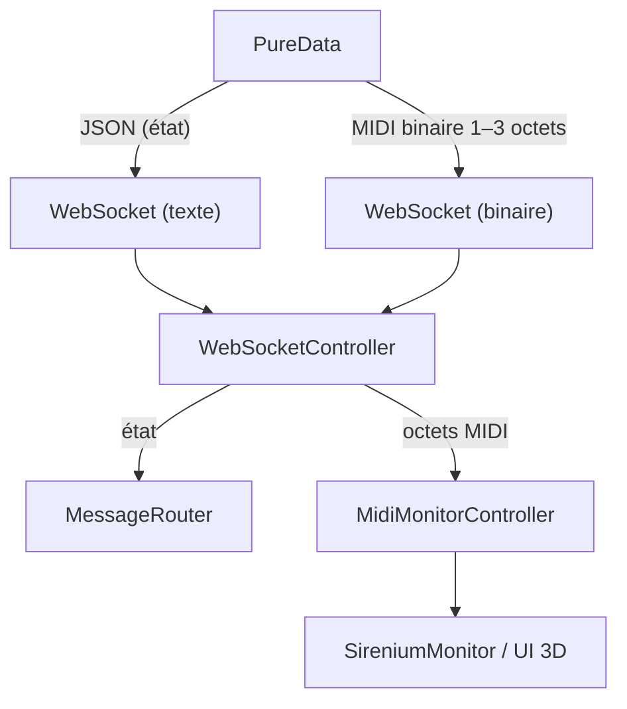

# Architecture de Communication (JSON + MIDI binaire)

Ce document décrit le flux de données entre PureData et l’application Qt/QML (WASM), en séparant:

- JSON (texte) pour le monitoring/état (boucles, scènes, voix, presets, horloge agrégée)
- Frames binaires (1–3 octets) pour les événements MIDI temps réel (clock, Note/CC/Pitch Bend)

## Diagramme



## Encodage MIDI binaire

- Note On: `[0x90|n, note, velocity>0]`
- Note Off: `[0x80|n, note, 0]` (ou `[0x90|n, note, 0]`)
- Control Change: `[0xB0|n, cc, value]`
- Pitch Bend: `[0xE0|n, lsb, msb]` avec `bend14 = (msb<<7) | lsb`
- Clock (24 ppq): `0xF8` (1 octet). Start `0xFA`, Continue `0xFB`, Stop `0xFC`.

où `n ∈ [0..15]` est le canal MIDI.

## URL de connexion

```
ws://localhost:10000
```

## Notes d’implémentation

- 1 événement MIDI par frame WebSocket binaire (aucun JSON ni séparateur).
- Pas de logs par message dans le hot‑path côté QML pour préserver la latence.
- L’UI est mise à jour via le signal `midiDataChanged` du `MidiMonitorController`.


